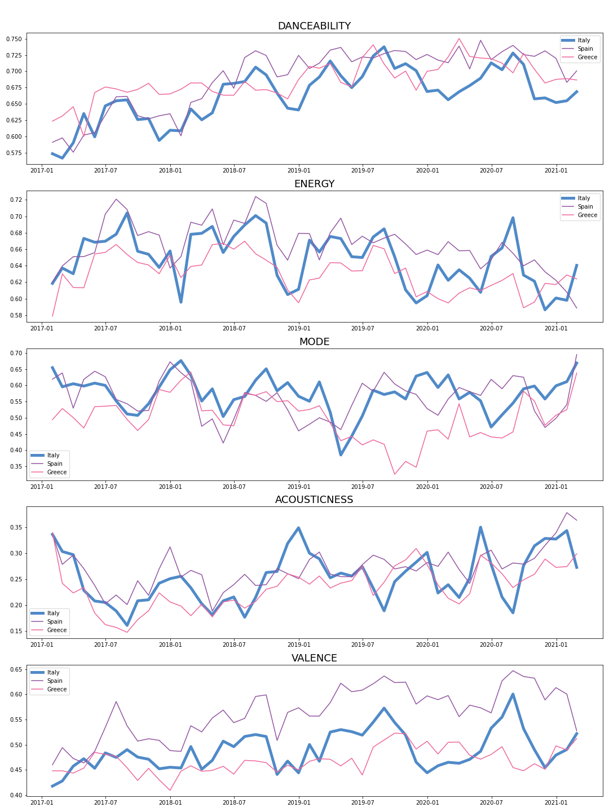
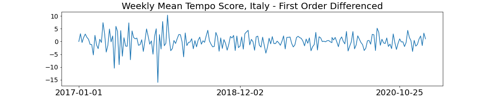
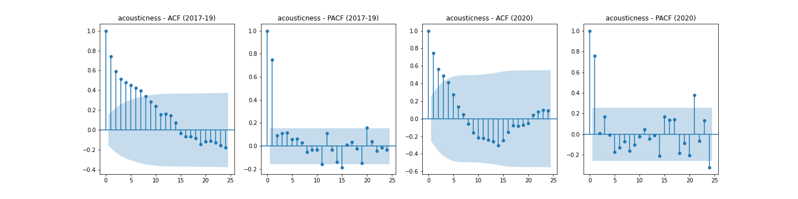
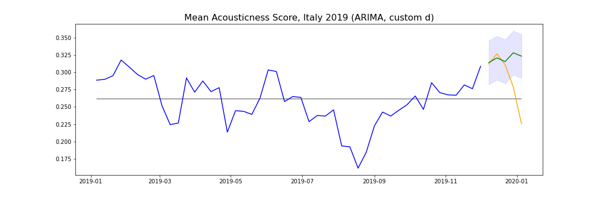
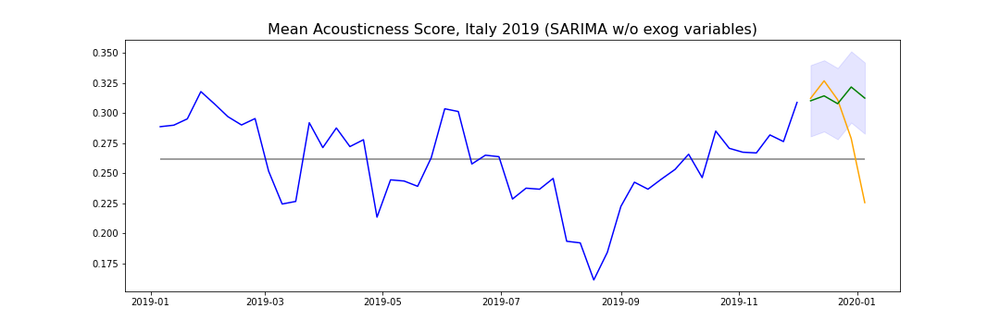
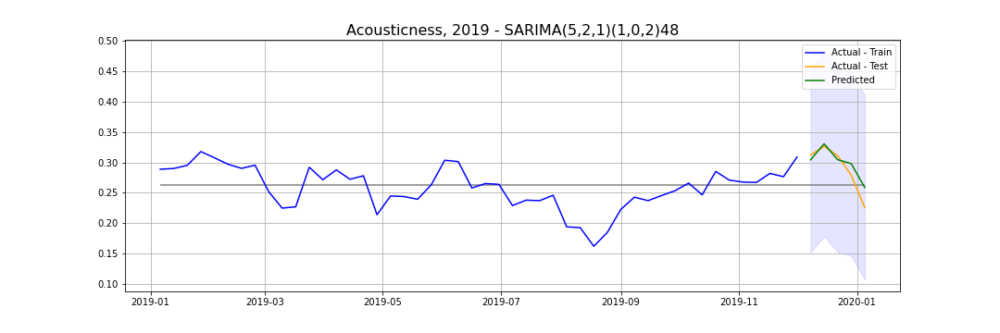
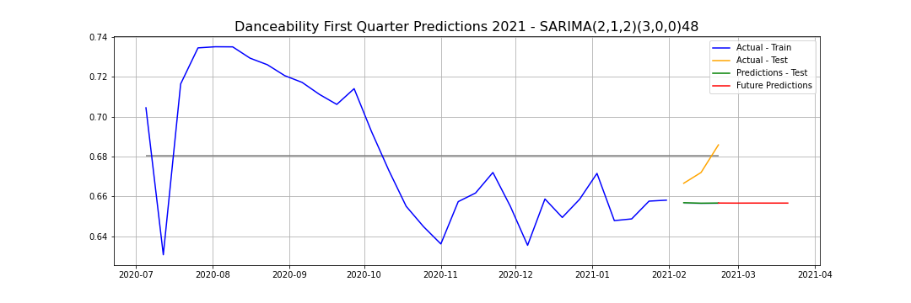
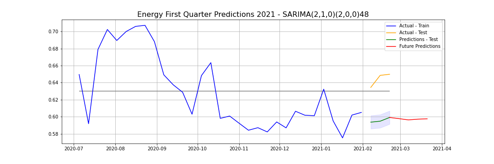
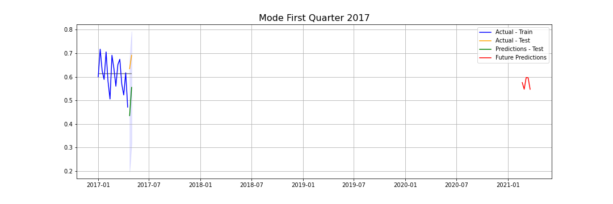
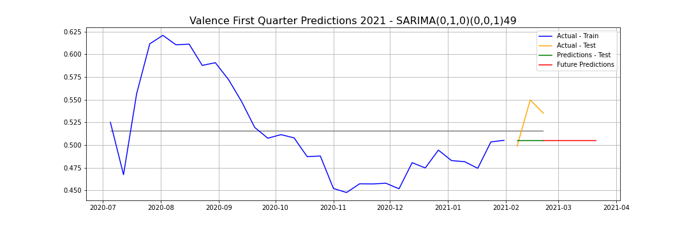

# MUSIC for the FUTURE

## Table of Contents

- [Executive Summary](#executive-summary)
- [Data Collection](#Data-Collection)
- [Data Cleaning & Pre-Processing](#Data-Cleaning--Pre-Processing)
- [EDA](#EDA)
- [Modeling](#modeling)
- [Evaluation & Analysis](#evaluation--analysis)
- [Next Steps & Future work](#next-steps--future-work)
- [Acknowledgements](#acknowledgements)

## Executive Summary


&nbsp;&nbsp;&nbsp;&nbsp;&nbsp;&nbsp;_How upbeat did popular music sound in the summer of 2017?_  
&nbsp;&nbsp;&nbsp;&nbsp;&nbsp;&nbsp;_What about the summer of 2018?_  
&nbsp;&nbsp;&nbsp;&nbsp;&nbsp;&nbsp;_Do the top-charting songs have more minor chords in autumn than in spring?_   
&nbsp;&nbsp;&nbsp;&nbsp;&nbsp;&nbsp;_Do listeners stream danceable hits around the holidays?_   
&nbsp;&nbsp;&nbsp;&nbsp;&nbsp;&nbsp;_Is there a time of year when acoustic songs are more popular?_

For this project, I set out to answer those questions and more. By tracking the presence of certain audio features in Spotify's most-streamed songs over time, we can start to understand patterns in the types of music that we want to hear at different times of the year and in new and changing ways over the years.

Music for the Future predicts the popularity of audio features in the future based on the presence of these audio features in historical data. Using ARIMA time series modeling, I identify trends in the data and make predictions about what listening habits will look like going forward.

We know that music evolves over time: the sound changes naturally as other cultural elements (visual artistry, fashion, etc. do). With music, we are more able to track these evolutions via discrete aural characteristics. Certainly, today's top charting songs are fairly different from those topping the charts 10/20/30/more years ago, and the question I investigate in this analysis is: Are apparent trends detectable by a data-driven analysis. And if so, can we build a machine learning model that tracks these evolutions and makes predictions on how present these characteristics will be in the coming weeks and months.   

#### *Why Do I Care?*

Tracking and predicting the relative presence of audio features has numerous and broad applications.

While large record labels and international touring acts can afford to hire a data scientist, independent musicians and music producers do not. Real insights, however, can certainly be gleaned by analyzing the data.

## Data Collection

*For Data Collection and Cleaning/Pre-Processing, see notebook: [01_scraping_viral_50_it_sp_gr](capstone/code/01_scraping_viral_50_it_sp_gr.ipynb)*

#### *Viral 50 Songs*

I got my the Viral 50 songs from Spotify Charts using the [fycharts](https://github.com/kelvingakuo/fycharts), a complete python package will excellent documentation on the github repo. I ran code similar to the following to get the daily Viral 50 songs from Italy, Spain, and Greece. I collected the songs from January 1, 2017 - February 20, 2021 in year-long chunks. Though I ended up doing modeling only on the Italy data, I at the point of collection I was unsure exactly how the project would ensue, and I used the Spain and Greece data heavily during EDA to explore connections to the patterns I saw in the Italy music.

```python
  api = SpotifyCharts()
  connector = sqlalchemy.create_engine("sqlite:///../dataa/italy_2017_v50.db", echo=False)
  api.viral50Daily(output_file = "../data/italy_2017_v50.csv", output_db = connector, webhook = ["https://mywebhookssite.com/post/"], start = "2017-01-01", end = "2017-12-31", region = "it")
```

#### *Audio Features*

For every song represented in the Viral 50 scrape, I requested data from Spotify using [Spotipy](https://spotipy.readthedocs.io/en/latest/), the lightweight Python library for the Spotify Web API. I used the **Client Credentials Flow**, which makes it possible to authenticate requests to the Spotify API and get song data, but prevents me from getting user data such as play or search history. (You need the **Authorization Code Flow** for this as it requires user authentification.)  This entailed the following steps:
1. Installed Spotipy with:
```
pip install spotipy --upgrade
```
2. Signed up for a developer account at [Spotify for Developers](https://developer.spotify.com/dashboard/applications/335a1dfd1f1b4eeaacd569c36fb342ef), which allowed me to receive a Client ID and Client Secret.
3. I stored the Client Id and Client Secret (both 32 digit codes) in a file called `spotify_credentials.json`. Subsequently, I ran the following block of code at the top of the notebook used for scraping:
```Python
with open("../spotify_credentials.json", "r") as json_file:
    creds = json.load(json_file)
my_client_id = creds['SPOTIPY_CLIENT_ID']
my_client_secret = creds['SPOTIPY_CLIENT_SECRET']
client_credentials_manager = SpotifyClientCredentials(client_id=my_client_id, client_secret=my_client_secret)
sp = spotipy.Spotify(client_credentials_manager=client_credentials_manager)
```
4. To make the requests, I accessed the Spotify Credentials using  `sp.audio_features()`, which I wrapped into the `get_merge_audio_features` function. The function makes the requests and stores the audio features for each song as a dictionary that is stored in a list containing dictionaries for all the songs.

## Data Cleaning & Pre-Processing

The data came in with no missing values so I didn't have to do much cleaning.

I used two functions to merge the audio features to the Viral 50 data and prepare the data for EDA:

+ `get_merge_audio_features` function does the following:
  1. Requests and gets audio feature data using Spotify's Credentials flow (see above).
  2. Stores the audio features as a dictionary, separately for each song. Dictionaries are stored in a list.
  3. Converts the list of dictionaries into a dataframe and
  appends to the original dataframe. Returns combined dataframe with all songs and audio features.


+ `clean_song_features_df` function does the following:
1. Drops unnecessary columns: `['type', 'id', 'uri', 'track_href', 'analysis_url']`
2. Converts date column to `datetime` format and sets it as the index.
3. Pickles clean dataframe for use in modeling.

## EDA

_See notebook: [02_time_series_eda_viral50](02_time_series_eda_viral50)_

The data came into the EDA process as dataframes with 50 rows for each day -- each row a song that was in the Viral 50 that day. I resampled the data by week and by month, creating new dataframes that then had one row for each week or month in that subset of the data. The columns were then each of the audio features, with that row's value being the mean score for that feature as its represented in all the songs from that week or month.

I used the weekly resampled data for the majority of modeling and analysis, but I used the dataframes with the monthly resample for plotting during the discovery process.

I plotted the monthly resampled data using simple line plots to identify trends over time.For each of the 11 audio features, I created line plots for each year as well as one for all the data 2017-2020, and I did this for each of the three countries individually and then also put them all on one plot. (I also plotted the data that was resampled by week. As I said above, though I mostly used the weekly resampled data in my analysis, those line plots had too much noise and movement so the data grouped by month elicited plots that were much easier to read.)

The 2017 - 2020 line plots using monthly data looked like as follows:




 I used these plots to start to identify patterns and seasonality in the data. My models ended up using the Italy data, which is why I eventually bolded that line, but it was helpful to see how the progression matched against that in the other countries. Helped me see, for example, whether a trend was universal or perhaps a departure from what was happening with its European neighbors.

My EDA also included significant plotting related to time series analysis. In addition to the line plots of the original data resampled by week and by month, I also created line plots with the once-differenced data for each feature, exampled below for danceability:



I also created autocorrelation (ACF) plots and partial autocorrelation (PACF) plots for each audio feature. I did so for the 2017-19 data and separately for 2020 data in an effort to see whether the correlation had changed recognizably due to the very bizarre year that was 2020. Below is an example using acousticness.



Later in my analysis, I used functions to help determine the stationarity of data and decide how many orders of difference to use to achieve stationarity for each feature. The above plots, however, helped me to start to understand how stationary the data are and figure out what the next step would be.

I also looked at the correlation between the various audio features using Seaborn heatmaps to plot correlation matrices, but these visuals, while interesting and informative elements of my EDA, ultimately did not lend themselves to my final analysis.

At the end of the EDA process, I decided to focus on only a subset of the audio features for the sake of clarity and conciseness in the rest of my analysis. I settled on five features that appeared to show significant or compelling patterns or that, based on my knowledge of music, offered the information that was the most interesting and distinct from the other features.   

Five features used for modeling:
1. Danceability
2. Energy
3. Mode
4. Acousticness
5. Valence

## Modeling

I implemented the modeling separately for each year, so you will find four separate notebooks with models in the repo:

+ 2017: [03a_model_benchmarking_2017](capstone/code/03a_model_benchmarking_2017.ipynb)
+ 2018: [03a_model_benchmarking_2018](capstone/code/03a_model_benchmarking_2018.ipynb)
+ 2019: [03a_model_benchmarking_2019](capstone/code/03a_model_benchmarking_2019.ipynb)
+ 2020: [03a_model_benchmarking_2020](capstone/code/03a_model_benchmarking_2020.ipynb)

_Note_: They are called "`model_benchmarking`" because I initially was unsure whether these would be benchmarks leading to a one final model or be used as my final models. (Spoiler alert: I ultimately used these year-specific models as my final models and did not roll them into one that would be used for all the modeling and evaluation. For predicting the future, I used the hyperparameters and models built on 2020 data.)

_Note_: You will also find notebooks for 2018, 2019, and 2020 that were used to explore how accuracy would change depending on what subset of the time series data were used to determine the best hyperparameters (`order` and `seasonal order`).

I read the data into each notebook as the cleaned song data and then resampled it by week, to then have dataframes with weekly dataframe for each year and also for 2017-19 combined.

#### _Differencing_  ()  

In addition to scrutinizing the ACF/PACF and following rules for determining difference provided in this article, I used the Dickey-Fuller test and Joseph Nelson's `interpret_dftest` function to determine how many orders of differencing I needed to apply to each feature to achieve stationarity. For each feature for each year, I calculated the -value to see whether the null hypothesis of "the data are stationary" could be rejected. I also ran the tests and found the -value for the once-differenced data. Finally, I used the `ndiffs` sub-module from the `pmdarima.arima` python wrapper to estimate the number of differences required to make the time series stationary, allowing me to produce tables such as the following for each year:

|    | audio_feature   |   ndiffs for stationarity |
|---:|:----------------|--------------------------:|
|  0 | danceability    |                         1 |
|  1 | mode            |                         1 |
|  2 | acousticness    |                         0 |
|  3 | valence         |                         0 |
|  4 | energy          |                         0 |

I then used the value of d provided in this table for any modeling involving that feature for that year's data.

#### _Other Hyperparameters_

I used the value of d from the table above when I ran search for best values for the other two ARIMA hyperparameters, p and q. I performed the search for p and q using the function `find_p_and_q`, which searched for the hyperparameters that yielded the lowest aic given the current data and subsequently appended these values to a dataframe (with a dictionary intermediary), producing the following:
|    | audio_feature   |   ndiffs(d) |   best_p |   best_q | order     | ARIMA_model   |   ARIMA_AIC |
|---:|:----------------|------------:|---------:|---------:|:----------|:--------------|------------:|
|  0 | danceability    |           1 |        2 |        1 | (2, 1, 1) | ARIMA(2,1,1)  |    -726.879 |
|  1 | mode            |           1 |        4 |        3 | (4, 1, 3) | ARIMA(4,1,3)  |    -430.795 |
|  2 | acousticness    |           0 |        3 |        2 | (3, 0, 2) | ARIMA(3,0,2)  |    -600.574 |
|  3 | valence         |           0 |        2 |        2 | (2, 0, 2) | ARIMA(2,0,2)  |    -627.919 |
|  4 | energy          |           0 |        5 |        2 | (5, 0, 2) | ARIMA(5,0,2)  |    -690.871 |

I then used the values of p and q provided in this table for any modeling involving that feature for that year's data.

Similarly, when I got to SARIMA modeling, I searched for the best values for the seasonal orders. I used the `find_sarima_parameters` function to find the values for P,D, and Q that yielded the lowest MAE.

#### _Models!_

I used three related time series models: ARIMA, SARIMA, and SARIMAX. I ran each in that sequential order, separately for each feature, in year-long chunks. I trained  them on the first 90% of the year and made test predictions on the remainder of the year. Details on each below.

+ **ARIMA**

Using the `arima_predict_plot` function, I ran individual models for each feature. I used the parameters from the grid searches that populated the table above. The function will perform the following tasks:

1. Extract the right values for _d_ and the order from the table above.
2. Split the dataframe column in question into train and test sets.
3. Instantiate and fit an ARIMA model using the correct parameters.
4. Make predictions on the train and test sets.
5. Calculate the RMSE for the train and test sets and append them to dataframe tracking metrics. (The same one that is storing the best hyperparameter values.)
6. Draw a Matplotlib plot with the actual train and test values, the predictions for the test sets, and the confidence interval around the test pred.

An example output is below:



+ **SARIMA**

Using the `sarima_predict_plot_seasonal` function, I then ran individual models for each feature using a SARIMA model. The difference here is that I accounted by seaonality by incorporating a seasonal order that was determined for that feature by the `find_sarima_parameters` grid search function above. The SARIMA function performed the same tasks as the ARIMA function above -- instantiating, fitting, predicting, and plotting models for each feature -- but this time with a seasonal order passed.

An example output is below:



+ **SARIMAX**

Finaly, I used `sarima_predict_plot_exog` function to run SARIMAX models that included exogenous variables. In this case, the exogenous variables for each feature were the other four audio features. Similar to above, the function did the work of fitting a model and plotting the predictions, and I created one for each of the five audio features.

An example output is below:




## Evaluation & Analysis

_See notebook: [04_model_evaluation_metrics](capstone/code/04_model_evaluation_metrics.ipynb)_

Once I had run all the models for each feature separately for 2017, 2018, 2019, and 2020, I loaded all my individual results for the AIC and RMSE scores for each year into one dataframe containing all calculated metrics for that year like this one for 2020:

|    | audio_feature   |   ndiffs(d) |   best_p |   best_q | order     | ARIMA_model   |   ARIMA_AIC |   arima_train_rmse |   arima_test_rmse | seasonal_order   | seasonal_order_all_data   |   sarima_train_rmse |   sarima_test_rmse |   exog_train_rmse |   exog_test_rmse |   year |
|---:|:----------------|------------:|---------:|---------:|:----------|:--------------|------------:|-------------------:|------------------:|:-----------------|:--------------------------|--------------------:|-------------------:|------------------:|-----------------:|-------:|
|  0 | danceability    |           1 |        2 |        2 | (2, 1, 2) | ARIMA(2,1,2)  |    -214.352 |          0.0299546 |         0.0317951 | 3, 0, 0, 48      | 2, 0, 3, 48               |           0.0291546 |         0.00630312 |         0.0177028 |        0.0167928 |   2020 |
|  1 | mode            |           1 |        4 |        0 | (4, 1, 0) | ARIMA(4,1,0)  |    -187.657 |          0.0360043 |         0.0541578 | 1, 0, 1, 52      | 0, 0, 0, 48               |           0.0360335 |         0.0469778  |         0.0326225 |        0.0438344 |   2020 |
|  2 | acousticness    |           1 |        1 |        1 | (1, 1, 1) | ARIMA(1,1,1)  |    -170.836 |          0.0449079 |         0.0312725 | 1, 0, 2, 48      | 0, 1, 0, 48               |           0.0453494 |         0.0354436  |         0.0226259 |        0.0349103 |   2020 |
|  3 | valence         |           1 |        0 |        0 | (0, 1, 0) | ARIMA(0,1,0)  |    -208.242 |          0.036157  |         0.0401721 | 0, 0, 1, 49      | 1, 0, 3, 50               |           0.0326514 |         0.0260108  |         0.015722  |        0.0153029 |   2020 |
|  4 | energy          |           1 |        2 |        0 | (2, 1, 0) | ARIMA(2,1,0)  |    -224.361 |          0.026839  |         0.0206405 | 2, 0, 0, 49      | 0, 0, 2, 51               |           0.0269028 |         0.0165696  |         0.0109944 |        0.0126909 |   2020 |

I used these tables to take the average of the RMSE score across all features for each type of model. Though different years yielded somewhat different values for the mean RMSE score, SARIMAX proved to be the most successful model for 2019 and 2020 data and was not far behind for the other years. I ended up using the SARIMAX models for each year in the presentation attached to this project.

Alas, the whole point of this project was to forecast the popularity of these audio features into the future. In the [05_visualizations_and_forecasts](capstone/code/05_visualizations_and_forecasts.ipynb) notebook, I use the SARIMAX models with the hyperparameters found for the 2020 data to make a forecast for each feature. The training data for each model included June 2020 - February 2021, and the forecast was made for February 21, 2021 to March 20, 2021. The forecasting plots for each feature are below:







As you can see, the forecasted values do not appear to have good predictive power, as the predictions quickly revert to the mean in most cases.

This is slightly perplexing given the relatively low RMSE scores for my 2020 models with train and test sets. I think that one reason for this may be that I was using an order and seasonal order associated with 2020 data, but part of the data included in training set for the forecasts was from 2021. This could be a problem if stationarity and seasonality shifted in 2021, as this would demand different hyperparameters while I was using the same as for 2020.

#### _Conclusion_

The forecasting models need to be improved before they can provide valuable insights about how popular a given audio feature will be one month into the future. While ARIMA models are notoriously limited in how far into the future they can predict with any validity, I do believe that these models can be improved by tweaking hyperparameters and the date range used for predictions.

## Next Steps & Future work

1. ARIMA Model Tuning: Achieve better accuracy with the current ARIMA/SARIMA/SARIMAX models.
2. Data: Collect additional data, including other countries and other years, to improve model and test concept.
3. Additional Models: Implement other modeling techniques, start with Long Short-Term Memory (LSTM) / Recurrent Neural Network (RNN) models. Potentially incorporate addtional features, such as lyrics.
4. Deploy: Build an application to make the predictive modeling capabilities available to more independent musicians once the product is more viable.
5. Visualization: Implement better data visualization, e.g. [Plotly](https://plotly.com/) to development of patterns over time more clearly.
6. Correlation: Investigate correlation with weather, political events, pandemics, etc. to begin to understand what broader societal factors interrelate with music listening habits.

## Acknowledgements

While I offer ample credit throughout my notebooks where I received help from others, I want to give an additional shoutout here to the people without whom this project would never have come to completion:

+ Prasoon Karmacharya
+ Hovanes “Hov” Gasparian
+ Charlie Rice
+ Paul D. Miller
+ John D. Hazard
+ Heather Johansen
+ Amy Taylor (former DSI student whose capstone project [CNN for Dance Music Classification](https://github.com/amytaylor330/CNN_for_Dance_Music_Classification) provided great inspiration for me)
+ Kevin Gakuo (owns [fycharts](https://github.com/kelvingakuo/fycharts) github repo)

All these people spent time, care, energy, lifeblood to help me get here. Thank you.
